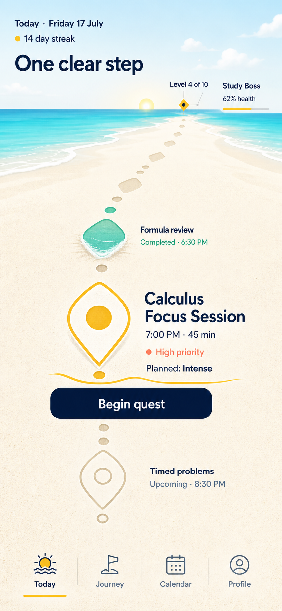

# Odyssey UI Design Specification

## Locked direction: Living Shore

**Status:** Locked

**Decision date:** 17 July 2026

**Primary surface:** React Native mobile application

**North-star screen:** Daily Quest Board / Today

> This document defines how Odyssey looks, moves, and responds. It does not
> decide what the product does.

Product behavior, progress rules, reward semantics, privacy boundaries, and AI
authority remain governed by [PRODUCT.md](PRODUCT.md). If this design document
ever conflicts with the product specification, the product specification wins.

---

## 1. The decision

Odyssey will use a **cinematic 3D world with a calm native interface**.

The visual system is called **Living Shore**. The user's daily work appears as
a path across a bright shoreline toward a distant destination. The environment
is not a decorative video behind a task list. It is a live, data-driven world
whose motion reflects real quest state while native controls preserve clarity,
accessibility, and trust.

The locked principles are:

1. **One clear step.** The next meaningful quest dominates the Today screen.
2. **The shore is alive.** Water, light, atmosphere, depth, and waypoints move
   continuously but quietly.
3. **Spectacle is earned.** The largest animation happens only after confirmed
   user progress.
4. **Motion tells the truth.** Scheduled, active, pending, completed, overdue,
   and missed states never share the same visual treatment.
5. **Native UI stays native.** Text, controls, navigation, focus order, and
   accessibility are not baked into an image or 3D texture.
6. **One world, not four unrelated tabs.** Navigation changes the camera's view
   of Odyssey's world while preserving familiar mobile controls.
7. **Brightness without noise.** The interface is sunny, open, and playful,
   never childish, casino-like, or visually exhausting.

---

## 2. North-star reference



This image locks:

- The bright shore, turquoise water, warm sand, and deep-ocean typography.
- The long perspective path between today's work and the horizon.
- One enlarged current quest, one completed quest, and one upcoming quest.
- A restrained roadmap-level and boss-health presentation near the destination.
- A native bottom navigation structure with Today, Journey, Calendar, and
  Profile.
- Spacious, editorial hierarchy led by the phrase **One clear step**.

The image does **not** lock rasterized text, exact generated icon shapes,
photographic water, or inaccessible color values. The production interface must
reconstruct the composition with native components and optimized 3D assets.

---

## 3. Experience thesis

Opening Odyssey should feel like stepping onto a quiet shore at the beginning
of a consequential day.

The user sees:

- Where they are now.
- The one action that deserves attention.
- Honest evidence of what was already completed.
- What is scheduled next.
- A distant but visible connection to the active journey.

The environment supplies wonder. Typography and controls supply certainty.

The interface must never make the user maintain the game instead of pursuing
the goal. Every visual flourish must strengthen orientation, emotional reward,
or comprehension.

---

## 4. Visual identity

### 4.1 Palette

The production palette uses high-contrast semantic tokens rather than sampling
colors directly from the generated image.

| Token | Value | Use |
| --- | --- | --- |
| `sky.morning` | `#DFF5FF` | Clear bright sky and atmospheric base |
| `water.primary` | `#18B8C8` | Ocean, active environmental motion |
| `water.deep` | `#08786F` | Accessible completed-state text |
| `sand.base` | `#FFF6E5` | Primary warm surface |
| `sand.shadow` | `#E7D7B9` | Terrain depth and upcoming markers |
| `ink.primary` | `#062A5A` | Primary text and controls |
| `ink.secondary` | `#52657A` | Secondary text on light surfaces |
| `sun.primary` | `#FFC72C` | Current waypoint and active accent |
| `priority.high` | `#B33A2E` | Accessible High-priority text |
| `priority.accent` | `#FF715B` | Non-text High-priority accent |
| `success.primary` | `#08786F` | Completed state and confirmation |
| `surface.white` | `#FFFFFF` | Text on deep controls and crisp overlays |

Verified text contrast on `sand.base`:

- `ink.primary`: 13.16:1
- `ink.secondary`: 5.59:1
- `priority.high`: 5.49:1
- `success.primary`: 4.98:1
- `surface.white` on `ink.primary`: 14.13:1

Yellow and bright coral are accents, not body-text colors.

### 4.2 Typography

- **Display:** Bricolage Grotesque Variable
- **Interface and data:** Manrope Variable
- Maximum of two font families in the application.
- Large editorial phrases use tight optical spacing but never sacrifice
  wrapping or Dynamic Type behavior.
- Body copy defaults to 15-16 px equivalent.
- Metadata defaults to 14-15 px equivalent.
- Primary controls remain at least 16 px equivalent and semibold.
- Tab labels remain visible; icons alone are not sufficient navigation.

### 4.3 Shape language

- Waypoints use a softened compass-drop geometry derived from the selected
  current marker.
- Containers use broad, calm radii rather than bubbly card shapes.
- Dividers follow shoreline curves only when the curve clarifies grouping.
- Repeated quest rows live on the base surface; they are not independent cards.
- Shadows are environmental and directional, not generic elevated rectangles.

### 4.4 Materials

- Sand: matte, softly granular, warm, and low contrast.
- Water: translucent turquoise with restrained foam and sun reflection.
- Current waypoint: satin ceramic or sea-polished resin with a warm core.
- Completed waypoint: sea glass with controlled translucency.
- Upcoming waypoint: pale stone outline with low visual weight.
- Boss landmark: distant, atmospheric, and legible as a milestone rather than a
  cartoon enemy.

No parchment, pirate props, wooden signs, treasure-map clichés, or tropical
vacation imagery.

---

## 5. The living world model

Living Shore uses one continuous visual world beneath native application
surfaces.

| Destination | Camera language | Environmental role |
| --- | --- | --- |
| Today | Low view along the footprints | Immediate action and daily sequence |
| Journey | Camera rises toward the horizon | Roadmap scale and connected stages |
| Calendar | Camera tilts toward a calm top-down shore | Time, recurrence, and schedule orientation |
| Profile | Camera eases toward a sheltered cove | Personal identity, earned cosmetics, and history |

These camera treatments do not define feature content. They visually orient
the product destinations already defined elsewhere.

The native bottom navigation remains fixed, clear, and tappable throughout.
Camera movement may accompany a destination change, but navigation must never
wait for an animation to finish.

---

## 6. Today screen anatomy

The Today screen is composed as five visual bands, not five cards.

### 6.1 Orientation band

- Local date.
- Overall Odyssey streak, explicitly labeled.
- One short editorial phrase such as **One clear step**.
- Large title does not displace the current quest below the initial viewport on
  supported reference devices.

### 6.2 Horizon band

- Distant destination landmark.
- Current roadmap level, explicitly labeled as roadmap progress.
- Active boss name and health, explicitly labeled as boss health.
- Roadmap progress and boss health are never combined into one bar.

### 6.3 Trail band

- Earlier, current, and upcoming quest occurrences appear in temporal order.
- Perspective supplies depth but labels remain screen-aligned native text.
- Repeated footprints use one instanced 3D mesh rather than separate heavy
  models.
- The current quest occupies the strongest scale, contrast, and touch target.

### 6.4 Action band

- One primary action: **Begin quest**.
- Schedule, duration, priority, and planned intensity remain visible before the
  action.
- The button is native, accessible, and at least 48 px high.
- Press feedback uses scale, depth, lighting, and a soft haptic without moving
  the hit target away from the finger.

### 6.5 Navigation band

- Today, Journey, Calendar, Profile.
- Icon and text label for every destination.
- Selected state uses color, weight, and a short underline; color alone is not
  the only indicator.
- Safe-area padding remains part of the layout, not the background artwork.

---

## 7. Visual state semantics

Every quest occurrence receives one state treatment. Animation cannot invent or
change the state.

| State | Waypoint | Label | Environmental response |
| --- | --- | --- | --- |
| Scheduled | Warm yellow center | Scheduled time remains visible | Quiet hover and sun glint |
| In progress | Deep navy ring plus warm core | Active timer or status is explicit | Camera settles closer; ambient motion reduces |
| Completion pending | Yellow-to-neutral pulse | “Saving completion…” or equivalent | No reward, boss damage, or completed footprint yet |
| Completed | Sea-glass turquoise fill | “Completed” plus completion time | One confirmed wash animation, then calm |
| Upcoming | Pale stone outline | “Upcoming” plus scheduled time | No pulse or reward treatment |
| Overdue | Accessible coral edge | “Overdue” plus relevant time | Slow tide-line emphasis; no alarm-like shake |
| Missed | Muted solid marker retained in history | “Missed” | Marker remains visible; no erasure of earned path |
| Disabled/unavailable | Neutral reduced-contrast form | Reason remains readable | No interactive animation |

Planned intensity appears before completion. Actual intensity appears only after
the user records it. Neither is communicated by color alone.

---

## 8. Motion doctrine

### 8.1 Motion has three levels

**Ambient motion** keeps the world alive:

- Slow water displacement and foam drift.
- Soft cloud parallax.
- Sun reflection and restrained waypoint float.
- Atmospheric horizon movement.
- Twelve-to-twenty-second cycles with no obvious loop seam.

**Responsive motion** acknowledges intent:

- Touch depth on the current waypoint.
- Limited device-tilt parallax.
- Scroll-linked perspective.
- Button compression and lighting response.
- Camera movement between world destinations.

**Earned motion** marks confirmed progress:

- A wave washes through the completed waypoint.
- The next footprint becomes visible.
- The camera advances toward the horizon.
- Boss health changes only after the underlying completion is confirmed.
- XP and rubies remain separately labeled.

### 8.2 Motion timing

| Motion | Target duration | Character |
| --- | --- | --- |
| Tap response | 90-140 ms | Immediate and physical |
| Marker settle | 180-260 ms | Soft spring, no bounce loop |
| Screen entry | 700-1,000 ms | Layered but skippable |
| Destination camera move | 450-700 ms | Controlled cinematic glide |
| Begin-quest transition | 500-750 ms | Forward commitment |
| Confirmed completion sequence | 1,300-1,700 ms | Earned and memorable |
| Error recovery | 180-300 ms | Plain, calm, and reversible |

No essential control waits for these durations. Repeated actions shorten or
skip already-seen staging.

### 8.3 Today entry choreography

1. Native text and navigation become usable immediately.
2. A static poster frame fills the 3D region while assets initialize.
3. The live scene crossfades in without layout movement.
4. The horizon gains focus.
5. Existing footprints resolve from distant to near.
6. The current waypoint settles once.
7. Ambient water continues; the rest of the interface becomes still.

### 8.4 Begin-quest choreography

1. Button compresses under the finger.
2. Soft haptic confirms the press.
3. Current waypoint leans forward and its shadow tightens.
4. Camera advances slightly along the trail.
5. Native content transitions to the existing quest flow.

The animation does not start, complete, or persist a quest on its own.

### 8.5 Confirmed completion choreography

1. UI enters `completionPending` while persistence is unresolved.
2. Successful persistence changes the domain state to `completed`.
3. A turquoise wash crosses the waypoint.
4. The marker material becomes sea glass.
5. One new footprint illuminates toward the horizon.
6. Camera advances a restrained distance.
7. Boss health animates from the previous confirmed value to the new confirmed
   value.
8. XP and rubies appear as separate earned results.
9. Success haptic lands at the final settled frame.

On failure, the scene returns to the truthful pre-completion state and presents
the recoverable error. It never shows a fake reward and retracts it later.

---

## 9. Render architecture

The screen uses one active 3D surface beneath native React Native content.

```text
Supabase-confirmed product state
              |
              v
     Typed presentation model
              |
              v
       XState motion director
        /        |        \
       v         v         v
3D scene      Native UI   Haptics
```

### 9.1 Native layer

Owns:

- Text and Dynamic Type.
- Buttons and touch targets.
- Bottom navigation.
- Screen-reader structure and announcements.
- Loading, empty, failure, offline, and reduced-motion states.
- All semantics and real data formatting.

### 9.2 3D layer

Owns:

- Sand plane and long trail.
- Water surface and shoreline foam.
- Sun, atmosphere, and distant landmark.
- Instanced footprints.
- Current/completed/upcoming waypoint meshes.
- Camera, lights, shadows, and touch-correlated visual response.

It does not own text, business state, persistence, navigation authority, or
reward calculation.

### 9.3 Motion director

The motion state machine is a presentation projection, not the product database.

```text
entering -> idle -> pressing -> launching -> settled
                    |
                    +-> completionPending -> celebrating -> settled

completionPending -> failure -> idle
```

The state machine consumes confirmed product events and exposes a small set of
animation values such as:

- `sceneProgress`
- `cameraDepth`
- `touchPosition`
- `questVisualState`
- `completionProgress`
- `destinationProgress`
- `reduceMotion`
- `qualityTier`

No React state update runs once per frame.

---

## 10. Locked implementation stack

Dependencies should be installed only after the Expo application scaffold
exists. Expo-managed packages must be installed through `npx expo install` so
SDK-compatible versions are selected. JavaScript packages must be pinned after
the first physical-device compatibility spike.

### 10.1 Core application

| Dependency | Role |
| --- | --- |
| `expo` / Expo SDK 57 | Application platform and native module compatibility |
| `react-native` / SDK-managed version | Native UI surface |
| `typescript` | Typed UI, scene, and state contracts |
| `expo-router` | File-based native navigation |
| `react-native-safe-area-context` | Device-safe composition |
| `react-native-screens` | Native screen lifecycle and transitions |

### 10.2 Motion and interaction

| Dependency | Role |
| --- | --- |
| `react-native-reanimated` | UI-thread native component motion |
| `react-native-worklets` | Worklet runtime required by current Reanimated |
| `react-native-gesture-handler` | Reliable press, pan, and drag gestures |
| `xstate` | Explicit presentation and choreography state machine |
| `@xstate/react` | React integration with selective subscriptions |
| `expo-haptics` | Optional native tactile feedback |
| `expo-sensors` | Restrained device-tilt parallax |

### 10.3 3D world

| Dependency | Role |
| --- | --- |
| `three` | 3D renderer primitives, materials, cameras, and shaders |
| `@react-three/fiber` | React renderer for the Three.js scene |
| `@react-three/drei` | Native-compatible GLTF loading and scene helpers |
| `expo-gl` | Expo OpenGL ES rendering target |
| `expo-asset` | Bundled GLB and texture loading |

Native imports must use `@react-three/fiber/native` and supported
`@react-three/drei/native` exports.

### 10.4 Supporting visual layer

| Dependency | Role |
| --- | --- |
| `@shopify/react-native-skia` | High-performance 2D effects on non-3D surfaces and a simplified fallback renderer |
| `expo-image` | Cached poster frames and static quality fallbacks |
| `react-native-svg` | Accessible vector icons and simple diagrams |
| `lucide-react-native` | Consistent baseline icon system where custom assets are not required |
| `expo-font` | Bundled variable-font loading |
| `@expo-google-fonts/bricolage-grotesque` | Display font package |
| `@expo-google-fonts/manrope` | Interface font package |

Skia and the full Three.js world must not render as competing full-screen GPU
surfaces at the same time. Skia is for other surfaces or the simplified quality
tier.

### 10.5 Device quality and lifecycle

| Dependency | Role |
| --- | --- |
| `expo-battery` | Low-power awareness and animation quality decisions |
| React Native `AppState` | Pause rendering when the app is not active |

### 10.6 Development and asset tooling

| Dependency/tool | Role |
| --- | --- |
| Blender | Authored geometry, UVs, materials, and reference motion |
| `@gltf-transform/cli` | Validate and optimize GLB assets |
| Jest + Expo preset | Logic and component tests |
| `@testing-library/react-native` | Accessible native interaction tests |
| XState model tests | Legal transition and late-success/failure coverage |
| Maestro | Representative device-flow smoke tests |

### 10.7 Deliberate exclusions

- No Lottie in the primary motion path.
- No Rive runtime in the primary motion path.
- No video background as the normal screen.
- No WebView-rendered Three.js scene.
- No multiple always-running GL canvases.
- No unbounded particle engine.
- No animation library that duplicates Reanimated, Three.js, or XState without a
  measured need.

The goal is not the most dependencies. It is the smallest coherent stack that
can produce the most ambitious dependable result.

---

## 11. 3D asset contract

### 11.1 Authored assets

- `shore-environment.glb`: sand, water boundary, horizon geometry.
- `quest-waypoint.glb`: one reusable waypoint with material slots.
- `footprint.glb`: one instanced geometric marker.
- `journey-landmark.glb`: distant stage landmark.
- Texture atlas for sand, foam, waypoint materials, and landmark details.
- Static poster frame matching the loaded scene composition.

Names are implementation guidance, not an imposed repository layout.

### 11.2 Scene construction

- Use a shallow perspective camera to preserve the long trail without wide-angle
  distortion.
- Use one directional sun and one low-cost ambient or hemisphere light.
- Bake most shadow information into materials.
- Reserve a small dynamic contact shadow for the current waypoint when the
  quality tier permits it.
- Use instancing for repeated footprints.
- Keep labels out of the 3D scene.
- Use shader motion for water rather than high-density simulated geometry.
- Avoid transparent layers stacked across the whole viewport.

### 11.3 Initial budgets

These are starting budgets to validate on physical devices, not promises made
without measurement:

- One active GL context for the screen.
- 25-40 draw calls in the Today scene.
- Fewer than approximately 100,000 visible triangles.
- Mostly 512-1,024 px textures.
- Under approximately 8 MB compressed scene assets for the initial Today world.
- No expensive real-time reflection pass.
- No full-scene post-processing chain.

Compression format and texture strategy must be chosen after the physical-device
spike proves loader support and visual quality.

---

## 12. Adaptive quality

Living Shore is one art direction with several render tiers, not separate visual
identities.

### Full tier

- Animated shader water and foam.
- Device-tilt parallax.
- Dynamic waypoint contact shadow.
- Full atmospheric depth.
- Targeted completion particles.

### Balanced tier

- Lower water resolution.
- No dynamic contact shadow.
- Reduced cloud and foam updates.
- Capped device pixel ratio.
- Fewer particles.

### Calm tier

- Static or low-frequency Skia/poster-frame environment.
- Native waypoint state changes.
- No device tilt.
- Simple opacity and transform transitions.
- Full information, controls, and earned-result clarity retained.

Tier selection may consider device capability, measured frame stability, Reduce
Motion, Low Power Mode, thermal pressure when available, and explicit user
preference. It must never use personal goal data.

---

## 13. Performance targets

- Target stable 60 FPS on the agreed mid-range Android reference device and a
  supported physical iPhone.
- Treat 16.7 ms as the per-frame budget at 60 FPS.
- Test release or optimized debug builds; normal development performance is not
  final evidence.
- Native text and controls must become usable before the 3D scene finishes
  loading.
- A cached poster frame prevents a blank or flashing environment.
- Pause the render loop when the screen is unfocused or the application is in
  the background.
- Stop ambient animation while an operating-system overlay covers the app when
  detectable.
- Avoid per-frame React renders and JavaScript-to-native chatter.
- Measure CPU, GPU, memory, thermal behavior, and battery impact on physical
  devices.
- Test iOS 3D behavior on hardware, not only a simulator.

A visually impressive screen that cannot hold its frame budget is not complete.

---

## 14. Accessibility

### 14.1 Reduced motion

When Reduce Motion is enabled:

- Remove device-tilt parallax.
- Replace camera pushes with short crossfades.
- Stop continuous waypoint floating.
- Reduce water to static or very low-frequency movement.
- Change quest state directly without traveling effects.
- Preserve every label, reward result, boss-health update, and error message.

### 14.2 Screen readers

- The 3D scene is decorative unless a specific mesh represents an interactive
  native control.
- Native quest controls expose title, time, state, priority, intensity, and
  action.
- Completed, missed, and overdue are spoken explicitly.
- Completion announcements happen after confirmed persistence.
- Decorative environmental changes are not announced.

### 14.3 Touch and text

- Minimum 44 x 44 pt touch target; primary action targets at least 48 pt high.
- Dynamic Type cannot hide the quest action or state.
- Support increased contrast and bold-text settings where available.
- Never encode priority, completion, intensity, or boss health by color alone.
- Keep native focus order aligned with the visual reading order.

### 14.4 Haptics

- Haptics reinforce visible and spoken feedback.
- Haptics are never the sole confirmation.
- Respect operating-system availability and user settings.
- Do not vibrate continuously or on passive ambient events.

---

## 15. Responsive composition

- Reference frame: 390 x 844 portrait.
- Compose against safe-area bounds rather than scaling the reference image.
- Use native layout for all text and controls.
- Maintain the horizon in the upper third where practical.
- Preserve a visible current quest and primary action without requiring scroll on
  reference devices.
- On shorter devices, reduce atmospheric height before reducing text size.
- On larger devices, extend environmental depth and spacing rather than scaling
  controls excessively.
- On tablets, retain a focused mobile-width quest column inside a wider living
  world; do not stretch line lengths across the screen.
- Support orientation policy defined by the application; this document does not
  decide that product-level policy.

---

## 16. Loading, offline, and failure presentation

### Loading

- Native shell appears immediately.
- Poster frame occupies the world region.
- No generic spinner floats over the primary quest when known data is available.
- Live scene crossfades in only after it is ready.

### Offline

- Preserve cached truthful quest state.
- Show offline status in native UI.
- Do not animate unconfirmed completion, rewards, or boss damage as final.

### Persistence failure

- Keep the action recoverable.
- Restore the truthful visual state.
- Explain what was not saved.
- Avoid punitive shake, red full-screen flashes, or disappearing progress.

### 3D failure

- Fall back to the poster or calm renderer.
- Preserve the complete native workflow.
- Log the graphics failure without exposing user data.
- A graphics failure must never block the user's quest workflow.

---

## 17. Design anti-patterns

Do not ship:

- The generated mockup as a flattened interactive background.
- Card grids placed over the beach.
- Constant camera motion.
- Multiple elements pulsing for attention at once.
- Reward explosions for routine taps.
- Fake boss damage while persistence is pending.
- A completed state inferred from the end of an animation.
- Tiny labels attached directly to moving meshes.
- Photoreal water beside flat cartoon controls.
- Treasure chests, coins, or rubies styled like gambling mechanics.
- Palm-tree, pirate, parchment, or nautical-wheel clichés.
- Dark overlays that destroy the bright-shore direction.
- Motion without a reduced-motion equivalent.
- A low-end fallback that removes information or actions.
- A dependency added only because it produces a flashy demo.

---

## 18. Implementation sequence

### Phase 1: foundation and proof

1. Scaffold Expo SDK 57 with TypeScript and native routing.
2. Install the locked core motion and 3D stack through compatible package paths.
3. Build a technical spike containing water, sand, one instanced footprint trail,
   one waypoint, native overlay text, and a primary button.
4. Test the spike on a physical mid-range Android device and physical iPhone.
5. Confirm frame stability, asset loading, touch behavior, background pausing,
   and fallback rendering before expanding the scene.

### Phase 2: static fidelity

1. Match the north-star composition at the reference viewport.
2. Implement native typography, semantic colors, navigation, and quest hierarchy.
3. Add scheduled, completed, upcoming, overdue, missed, loading, and failure
   frames.
4. Compare the visual target and implementation at the same dimensions.

### Phase 3: living environment

1. Add water and atmospheric motion.
2. Add touch response, device tilt, and scroll-linked depth.
3. Add adaptive quality and background pausing.
4. Validate motion on hardware and under Reduce Motion.

### Phase 4: truthful choreography

1. Connect the presentation state machine to real quest state.
2. Protect late success, late failure, repeated taps, navigation-away, and
   application-background transitions.
3. Add begin-quest and confirmed-completion sequences.
4. Verify boss health, rewards, and recorded intensity against persisted data.

### Phase 5: world navigation

1. Extend the camera language to Journey, Calendar, and Profile without blocking
   native navigation.
2. Keep only one expensive world surface active.
3. Run accessibility, performance, lifecycle, and full-flow regression checks.

---

## 19. Definition of done

Living Shore is ready only when:

- The production Today screen preserves the selected composition and hierarchy.
- The beach is a real responsive scene rather than a flattened video or image.
- Native controls remain immediately usable and accessible.
- Scheduled, completed, upcoming, overdue, and missed states are unmistakable.
- Planned and actual intensity never blur together.
- Roadmap level, account level, streak, goal progress, and boss health remain
  separately labeled.
- No reward or boss change appears before persistence succeeds.
- Late success and late failure paths are both safe.
- The full tier holds the agreed frame target on physical reference devices.
- Balanced and calm tiers preserve the same information and actions.
- Reduce Motion, screen-reader, large-text, offline, and graphics-failure paths
  are verified.
- Navigation works even if camera animation is interrupted or unavailable.
- The interface remains bright, minimal, calm, adventurous, and unmistakably
  Odyssey.

---

## 20. Technical references

- [Expo SDK 57 GLView](https://docs.expo.dev/versions/v57.0.0/sdk/gl-view/)
- [Expo Reanimated integration](https://docs.expo.dev/versions/latest/sdk/reanimated/)
- [Expo SDK 57 Haptics](https://docs.expo.dev/versions/v57.0.0/sdk/haptics/)
- [React Three Fiber React Native setup](https://r3f.docs.pmnd.rs/getting-started/installation)
- [React Native Skia installation and Expo support](https://shopify.github.io/react-native-skia/docs/getting-started/installation/)
- [XState React integration](https://stately.ai/docs/xstate-react)

These references establish feasibility and integration direction. Exact package
versions and native configuration must be resolved and verified when the mobile
application is scaffolded.
