# Odyssey Product-to-UI Integration Audit

- **Audit date:** 2026-07-18
- **Product contract:** `docs/PRODUCT.md`
- **Frontend audited:** current `main` Expo Router application
- **Viewport used for rendered checks:** 390 × 844, mobile/touch emulation
- **Backend assumption:** mocked data and responses are acceptable for this phase; every product capability should still have a findable, understandable UI entry point and a credible interaction path.

## Remediation verdict — 2026-07-19

**Yes for the requested backend-later UI phase: every capability below now has a reachable, understandable, interactive frontend base.**

Task 014 closed the 17 partial shells and 2 missing flows identified by this audit without treating mock state as production persistence. The implemented UI bases now include:

- a date-derived Calendar with distinct Month and Week ranges, working navigation, per-day filtering, and selected-date quest creation;
- structured local schedule/deadline controls, recurrence rules and preview, complete quest editing, future-series editing, and missed/overdue recovery;
- deterministic Today ordering by state, deadline, priority, scheduled time, and roadmap relevance, with a visible reason for the featured quest;
- full proposal and accepted-roadmap editors for purpose, milestone, habits, tasks, reorder, per-level regeneration, and scheduling, while completed stages remain read-only and activation remains explicit;
- editable goal planning context including starting point, availability, time budget, preferred effort, constraints, and deadline;
- actionable boosts, eligible-miss streak protection, ruby unlock confirmation, and a reward ledger;
- final-victory confirmation, a completed-Odyssey section, preserved victory records, and a clear next-Odyssey handoff;
- derived week/month, habit-specific, and goal-specific analytics with occurrence and private-proof history;
- notification-to-action navigation after mark-read and explicit empty states for the major collections;
- corrected decorative-image semantics and quest-card accessible naming. A current 390 × 844 mobile Lighthouse snapshot scored **100 for Accessibility** and **100 for Best Practices**.

Current rendered evidence and the Lighthouse HTML/JSON reports are in `.agents/audits/product-ui-remediation-2026-07-18/`. The browser result remains web evidence, not native VoiceOver/TalkBack or WCAG certification.

Backend ownership is still intentionally outstanding for Supabase authentication/persistence/RLS, recurrence materialization beyond loaded occurrences, private proof upload/storage, Groq generation, notification delivery, and server-authoritative progress/reward calculation. Those systems can replace the typed adapters without redesigning these flows.

## Baseline verdict (before remediation)

At audit commit `092db43e824e7ce5d877f51e82fe63026995ae0c`, every documented product feature was not yet integrated into the UI.

Odyssey has a broad and unusually polished frontend base. All 27 user-facing route screens exist and are connected to the route tree, the four-tab information architecture is coherent, and the central loop—enter the demo, inspect today's work, open a quest, record actual intensity, review goals, and see rewards—was rendered successfully without a backend.

The remaining problem is not mainly missing screens. It is **false completeness inside existing screens**: controls or labels imply a documented feature is available, but the interaction does not yet perform that feature.

Across 30 product-capability groups traced from `docs/PRODUCT.md`:

- **11 have a complete UI base** for this backend-later phase.
- **17 have a reachable but incomplete UI shell.**
- **2 are absent as usable feature flows:** applying boosts and completing/preserving an Odyssey through a final-victory/history experience.

The highest-risk gaps are the roadmap editor, calendar, priority-driven Daily Quest Board, recurrence, quest editing, reward spending/boost use, and evidence/history analytics.

## What “integrated” means in this audit

A feature is counted as integrated only when:

1. A normal user can find it from the visible navigation or a logical parent screen.
2. The screen exposes the controls required by the product contract.
3. The control changes the relevant frontend state or calls the replaceable API adapter.
4. Loading, empty, blocked, failure, and confirmation states are present where the action needs them.
5. The interface does not claim behavior that is only represented by static seeded copy.

A route file, mock endpoint, button-shaped element, or explanatory paragraph by itself does not satisfy this standard.

## Route and discoverability map

The current application has **27 user-facing route screens**. The route architecture itself is complete enough to support the product.

Fifteen representative surfaces and states were rendered and captured in the current run. The remaining route coverage was established from the live Expo Router tree, navigation calls, source, typecheck/export gates, and route-specific state contracts; it was not inferred from route filenames alone.

| Surface | Routes | Normal entry | Discoverability |
| --- | --- | --- | --- |
| Entry and authentication | `/welcome`, `/sign-in`, `/sign-up` | App root | Easy |
| Primary shell | `/today`, `/journey`, `/calendar`, `/profile` | Persistent four-tab bar | Easy |
| Goals | `/goal/new`, `/goal/:goalId`, `/goal/:goalId/edit` | Journey → create or select a goal | Easy |
| Roadmaps | `/roadmap/generating`, `/roadmap/review`, `/roadmap/level/:levelId` | Goal creation or goal detail | Conditional but logical |
| Quests and proof | `/quest/new`, `/quest/:questId`, `/quest/:questId/complete`, `/proof/capture` | Today/Calendar → quest; completion → proof | Easy for active quests; conditional for proof |
| Rewards and analytics | `/rewards`, `/rewards/chest/:chestId`, `/analytics`, `/analytics/habit/:habitId`, `/analytics/goal/:goalId` | Profile → rewards/analytics | Easy at top level; detail routes are conditional |
| Reminders and settings | `/notifications`, `/settings`, `/settings/reminders`, `/settings/accessibility`, `/settings/privacy` | Bell or Profile → Settings | Easy at top level; two taps for detail |

### Conditional or effectively hidden surfaces

- Roadmap review is discoverable during new-goal creation, but there is no equivalent editor for an accepted roadmap.
- Habit analytics is exposed from a completed quest or the single analytics shortcut, not from a browsable habit list.
- Proof capture exists only inside a proof-enabled completion flow, which is appropriate; proof history does not have a route.
- The chest route is shown only when an unopened chest exists, which is appropriate.
- Boost use, streak-protection use, ruby spending, completed-Odyssey history, and final-victory evidence have no usable route or action.

## Complete product feature matrix

Legend:

- **Complete base:** the frontend interaction exists and can be connected to a backend without redesigning the flow.
- **Partial shell:** the feature is visible or partly interactive, but one or more documented user actions are missing or misleading.
- **Missing flow:** there is no usable UI endpoint for the documented capability.

| # | Product capability from `PRODUCT.md` | UI endpoint and entry | Status | Evidence and remaining gap |
| ---: | --- | --- | --- | --- |
| 1 | Welcome, register, sign in, sign out | `/welcome`, `/sign-up`, `/sign-in`, Profile → Settings | **Complete base** | Forms validate, call the adapter, show API errors, and navigate. Session persistence/route protection is backend-integration work, not a missing screen. |
| 2 | Goal intake with deadline, starting point, availability, time, preferred effort, constraints | Journey → “Begin another Odyssey” → `/goal/new` | **Complete base** | Every documented input has a visible control and the proposal is explicitly not active yet. |
| 3 | Protected AI roadmap generation with failure/retry | Goal intake → `/roadmap/generating` | **Complete base** | Loading, retry, and adapter-backed generation exist. Groq can be added behind the existing contract. |
| 4 | Fully editable proposal before acceptance | `/roadmap/review` | **Partial shell** | Users can rename level titles, reorder levels, regenerate all, and accept. They cannot edit purpose/milestone, add or remove habits/tasks, edit schedules/deadlines/priority/intensity, or regenerate one level. This is the largest mismatch with the product contract. |
| 5 | Ten-level roadmap with mini-bosses at 3/6/8 and final boss at 10 | Journey → goal detail → level detail | **Complete base** | All ten stages, boss types, milestones, suggested habits/tasks, locked/active/completed states, and connected quests are represented. |
| 6 | Multiple simultaneous Odysseys | Journey tab | **Complete base** | Three goals render independently with level, journey progress, boss, health, and detail navigation; another goal can be started. |
| 7 | Edit an existing goal without corrupting accepted progress | Goal detail → “Edit goal” | **Partial shell** | Title, description, and deadline can change. Starting point, availability, time budget, constraints, roadmap content, and post-acceptance plan adjustment have no UI. |
| 8 | Odyssey calendar with month/week views and date navigation | Calendar tab | **Partial shell** | The month grid and quest cards render, but Month and Week show the same grid, month arrows have no action, July 2026 and event dots are hard-coded, and only July 17 returns quests. This is not a functional calendar base yet. |
| 9 | Priority-driven Daily Quest Board combining scheduled, overdue, deadline, roadmap, and boss work | Today tab | **Partial shell** | The experience is strong visually and displays all required kinds of state, but sorting uses quest status only. Priority and deadline do not decide what rises, so the documented decision model is not integrated. |
| 10 | Create habits and one-time tasks with goal, schedule, deadline, priority, planned intensity, duration, recurrence, proof policy | Today/Calendar → Add → `/quest/new` | **Partial shell** | Every field exists and creation calls the adapter. Date/time requires raw ISO text and recurrence is free text, so the base is not yet easy or safe for normal users. |
| 11 | Daily, weekly, selected-day, and custom-interval recurrence with independent occurrences | Quest creation recurrence field | **Partial shell** | A recurrence string is captured, but there is no structured recurrence builder, occurrence preview, series editing, or frontend materialization/inspection of independent occurrences. |
| 12 | View, edit, reschedule, complete, or remove habits/tasks | `/quest/:questId` | **Partial shell** | View, complete, remove, and a fixed “+2h” mutation exist. There is no general edit screen and no user-selected date/time rescheduler; title, description, deadline, goal, recurrence, priority, intensity, and proof policy cannot be edited. |
| 13 | Clear scheduled, approaching-deadline, overdue, missed, and completed states | Today, Calendar, quest detail | **Partial shell** | State labels and colors exist. Missed and overdue records can display, but calendar/date logic is static and there is no dedicated missed-quest recovery or history path. |
| 14 | Device reminders and in-app reminders for start, deadline, and overdue events | Bell → `/notifications`; Profile → Settings → Reminders | **Partial shell** | Permission, three preference switches, lead time, inbox, empty state, and mark-read action exist. Notification cards only mark read; they do not open the related quest, goal, reward, or recovery action. |
| 15 | Record actual Light/Normal/Intense effort separately from planned effort | Quest → Complete | **Complete base** | Planned effort stays visible, actual intensity is selected independently, and confirmation has pending/failure/receipt states. |
| 16 | Per-habit proof policy, private capture, completion gating, and proof history | Quest creation; completion → `/proof/capture`; habit analytics | **Partial shell** | None/optional/required policy, image picker, preview, and required-proof gate exist. Upload/attach is unwired, policy cannot be edited later, and “Proof history” is explanatory copy rather than a browsable history. |
| 17 | Habit current/longest streak, scheduled/completed/missed counts, effort comparison, completion/proof history | Analytics → habit analytics | **Partial shell** | Summary cards and effort chart exist. All habits share one static mock read model; completion history and proof history lists do not exist. |
| 18 | Overall Odyssey streak, truthful misses, and recovery without erasing progress | Today and analytics | **Partial shell** | Overall streak is prominent and missed/overdue statuses exist. There is no streak-history/recovery surface and no interaction to apply streak protection after a miss. |
| 19 | Quest-driven boss health and roadmap progression | Today, goal detail, level detail, completion receipt | **Complete base** | Boss health is distinct from journey progress; only confirmed completion changes local boss health; the receipt shows the result. |
| 20 | Defeat final boss, complete the Odyssey, and preserve the completed journey as evidence | No route | **Missing flow** | There is no final-boss victory screen, goal-completion confirmation, completed-Odyssey archive/history, or “begin another Odyssey” handoff from a preserved victory. |
| 21 | Permanent XP and account level distinct from roadmap level | Today, Profile, Rewards | **Complete base** | Account and roadmap levels are clearly separated, XP progress is visible, and confirmed receipts add XP. |
| 22 | Earned rubies with traceable sources and useful unlocks | Profile, Rewards, completion/chest receipts | **Partial shell** | Balance and earning receipts exist. There is no reward ledger/source history and no ruby-spend or unlock action for boosts, protection, chests, or cosmetics. |
| 23 | Earn and open reward chests | Rewards → chest | **Complete base** | Earned count, opening action, pending/failure state, and server-style receipt are implemented. |
| 24 | Apply limited-use boosts without completing work for the user | Rewards | **Missing flow** | Boost names and quantities render as static cards. There is no Apply button, target/context selection, confirmation, receipt, or error state. |
| 25 | Streak protection | Profile and Rewards count | **Partial shell** | Inventory is visible, but there is no rule explanation, eligible miss, apply/decline interaction, consumption confirmation, or history. |
| 26 | Cosmetic unlocks and selection | Rewards | **Complete base** | Locked/unlocked/selected states render and unlocked cosmetics can be worn. Persistence is local for now but the UI endpoint exists. |
| 27 | Overall weekly/monthly analytics | Profile → Progress analytics | **Partial shell** | Metrics, chart, intensity mix, and drill-down entry exist. Week/month toggling reuses the same metric values and daily series; only the caption changes. Completed Odysseys and reward history are absent. |
| 28 | Habit analytics | Analytics → habit shortcut or completed habit | **Partial shell** | Current/longest streak, completed/scheduled/missed, and planned-vs-actual chart exist. Data is a shared static object, and occurrence/proof histories are not rendered. |
| 29 | Goal analytics | Goal detail or analytics → goal | **Partial shell** | Roadmap, stages, connected completion, boss health, and deadline signals are separated well. Several values and the explanatory deadline sentence are static rather than goal-specific. |
| 30 | Privacy/trust explanation and accessible presentation controls | Profile → Settings | **Complete base** | Privacy boundary, endpoint mode, reminder settings, reduced motion, graphics, haptics, and high contrast all have discoverable screens and controls. These do not replace backend enforcement. |

## Backend endpoint readiness

The frontend declares **31 HTTP method/path contracts** across authentication, profile, goals, roadmaps, quests, proof, rewards, analytics, notifications, and reminder preferences.

The current UI/provider actively invokes **13 operations**:

- sign in, sign up, sign out;
- update profile preferences;
- update a goal;
- generate and accept a roadmap;
- create, reschedule, remove, and complete a quest;
- open a chest;
- mark a notification read.

The remaining operations fall into three different buckets and should not be treated as one problem:

1. **Backend bootstrap/read wiring:** profile, goal, quest, reward, and notification GET operations. Their UI surfaces exist, but seeded state is used.
2. **UI exists but the contract is not wired:** proof upload/attach/read, analytics reads, dedicated reminder preferences, and cosmetic selection.
3. **UI action is missing:** boost application. The endpoint exists, but no screen can invoke it.

Direct goal creation also exists as an adapter contract, but the intended product flow correctly creates the accepted goal through roadmap acceptance instead.

## Highest-impact issues

### P0 — Replace false controls with real product behavior

1. **Build the real roadmap review editor.** Each level needs edit controls for title, purpose, milestone, suggested habits, and tasks; add/remove actions; schedule/priority/intensity editing for accepted items; and per-level regeneration. Preserve the explicit accept boundary.
2. **Make Calendar real.** Introduce an actual selected date/range, functional month navigation, a distinct week view, event placement derived from quest times, and correct per-day filtering.
3. **Make Today honor the product's priority model.** Rank by overdue/deadline urgency, Critical/High priority, scheduled time, and roadmap relevance with an explainable deterministic order.
4. **Add complete quest editing.** Replace “Reschedule +2h” with a date/time picker and expose editable title, description, deadline, recurrence, priority, planned intensity, goal connection, and proof policy where safe.

### P1 — Complete the missing game loops

5. Add an actionable reward economy: ruby source ledger, unlock/spend confirmation, boost application, and streak-protection use.
6. Add final-boss victory and completed-Odyssey history so level 10 has a real finish instead of ending at a health bar.
7. Add proof and completion histories, not only summary copy.
8. Make notification cards open the relevant quest, goal, reward, or recovery action after marking read.

### P2 — Replace presentation data with decision-grade data

9. Give week and month analytics distinct datasets and date ranges.
10. Make habit analytics habit-specific and render occurrence/proof history.
11. Make goal analytics goal-specific, including deadline copy and completed-stage data.
12. Add clear empty states for no goals, no quests today, no analytics, no rewards, and completed journeys; only some are present today.

## Accessibility and responsive findings

### Confirmed strengths

- Primary navigation is exposed as named tabs.
- Important icon-only controls have accessible labels.
- Progress indicators have labels.
- Charts expose a text alternative.
- The app provides reduced-motion, contrast, haptic, and graphics preferences.
- Mobile browser snapshots exposed coherent button, switch, tab, and progressbar semantics across the sampled flows.

### Confirmed risks

A current-run Lighthouse mobile snapshot on Today scored **95 for Accessibility** and found two accessibility failures:

1. Three decorative Tide Observatory images are emitted on web without `alt` text or presentation semantics.
2. Three quest-card buttons have accessible names whose wording does not contain the visible text exactly, producing label/content-name mismatch failures for voice-control and screen-reader users.

The report is saved beside the screenshots as `lighthouse-today.html` and `lighthouse-today.json`.

### Evidence limits

- The browser audit covered web rendering at a mobile viewport, not native iOS/Android screen readers.
- Screenshots cannot prove VoiceOver/TalkBack focus order, dynamic type, switch-control behavior, haptics, notification permission behavior, camera permission recovery, or color contrast in every state.
- Lighthouse does not prove WCAG conformance.
- The source review found minimum target sizing in several shared controls, but a full native touch-target measurement was not performed for every screen.

## Current-run rendered evidence

Every image below was captured from the current local app during this audit and visually inspected before acceptance.

### 1. Welcome — healthy

The value proposition, user agency, privacy promise, registration, sign-in, and demo entry are clear.

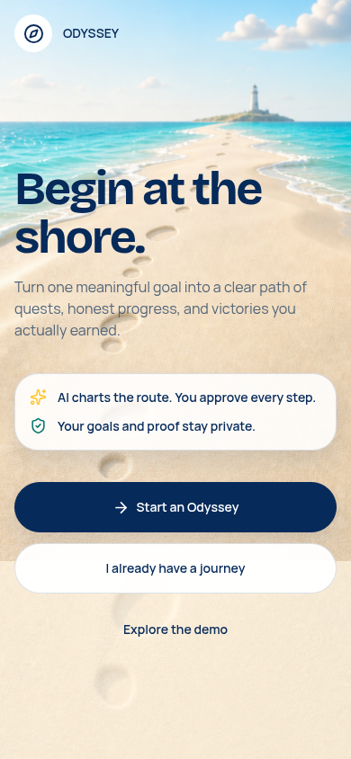

### 2. Today — healthy shell, incorrect prioritization model

The main loop is visible and highly accessible, but the ordering is driven by status rather than the documented priority/deadline model.

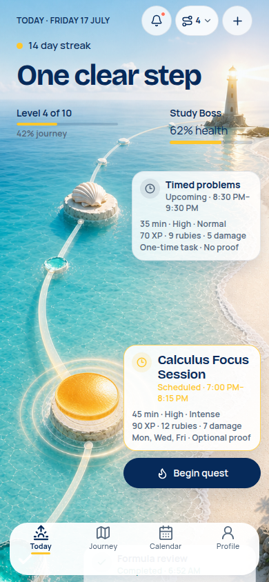

### 3. Journey — healthy

Multiple goals are easy to discover and remain visually separate.

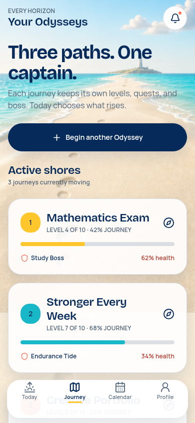

### 4. Goal detail — healthy shell

Roadmap level, boss health, analytics, editing, ten stages, and connected quests are easy to find.

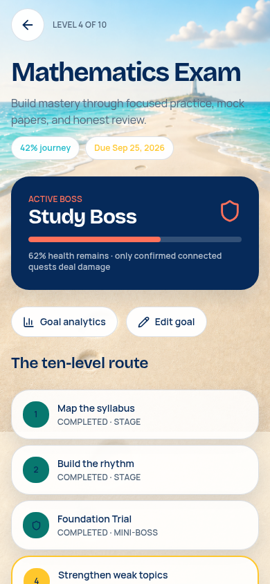

### 5. Goal builder — healthy, but long and picker-dependent

All generation inputs exist. Native date/time affordances are still needed elsewhere in the scheduling flow.

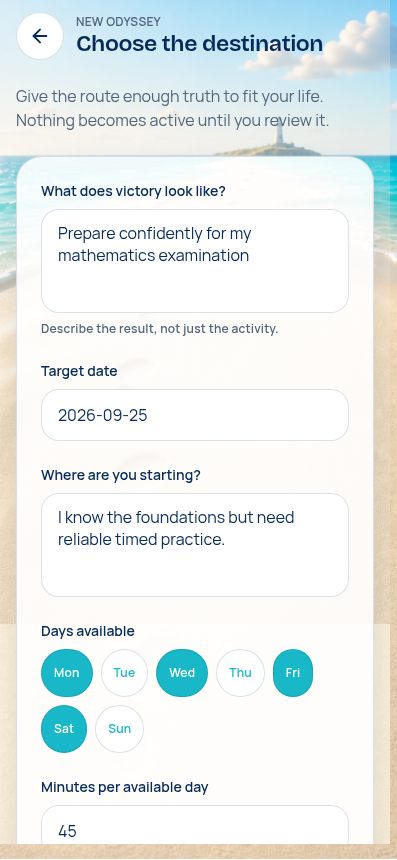

### 6. Roadmap review — incomplete

User acceptance is protected, but the editor exposes only title editing and stage reordering.

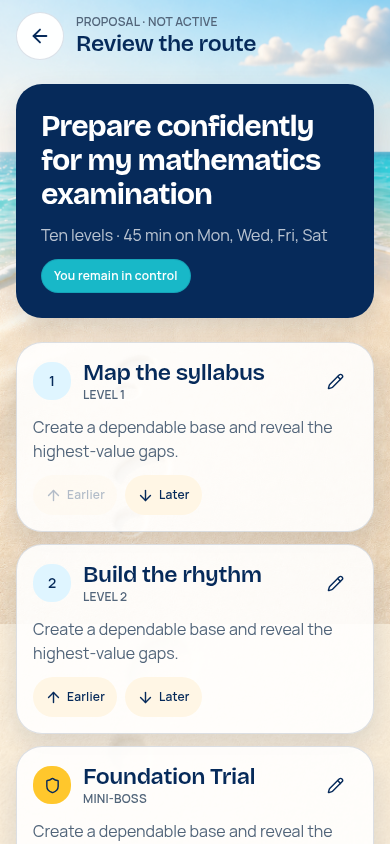

### 7. Calendar month — incomplete

The surface looks complete but is fixed to July 2026 and hard-coded event placement.

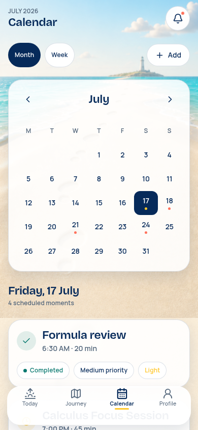

### 8. Calendar week — broken expectation

Selecting Week changes only the selected chip; the month grid and content stay the same.

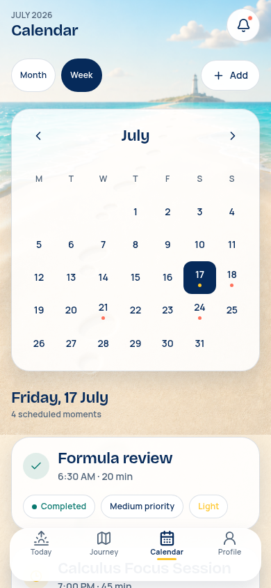

### 9. Quest builder — complete field inventory, weak input ergonomics

The feature fields exist, but raw ISO time and free-text recurrence are not easy or safe for ordinary use.

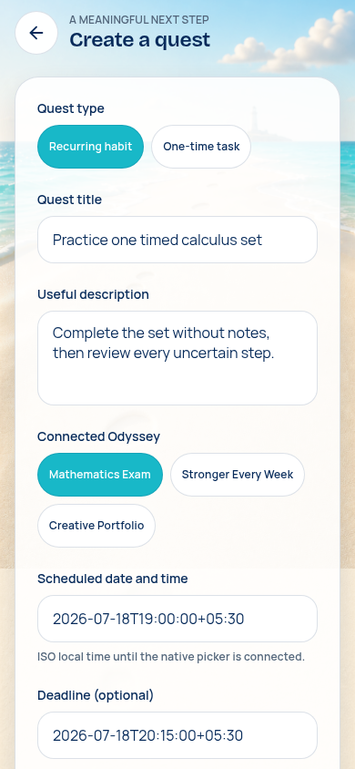

### 10. Completion — healthy

Planned and actual intensity remain distinct, proof policy is honored, and the confirmation boundary is clear.

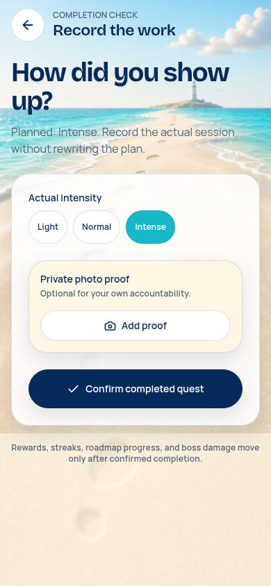

### 11. Proof capture — healthy base, missing history and live upload wiring

The private-evidence framing and capture/library choices are clear.

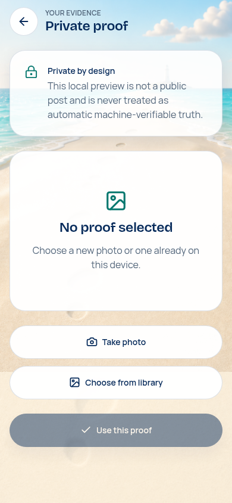

### 12. Profile — healthy hub

Permanent account progress is separated from roadmaps, and rewards, analytics, and settings are easy to reach.

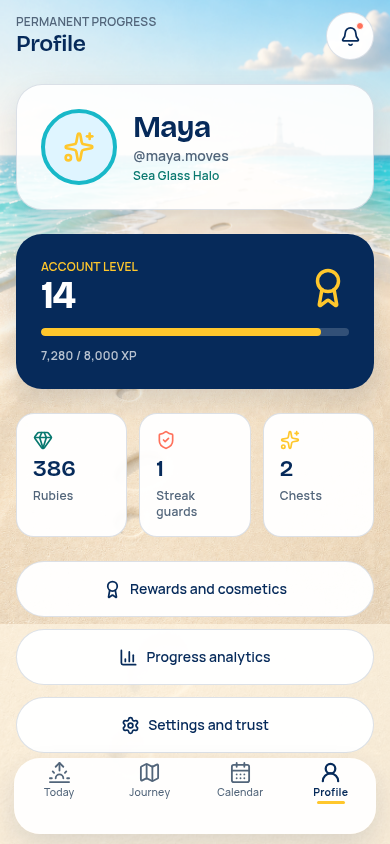

### 13. Rewards — incomplete game loop

Balances, chests, boosts, protection, and cosmetics are visible, but boosts and streak protection cannot be used and rubies cannot unlock anything.

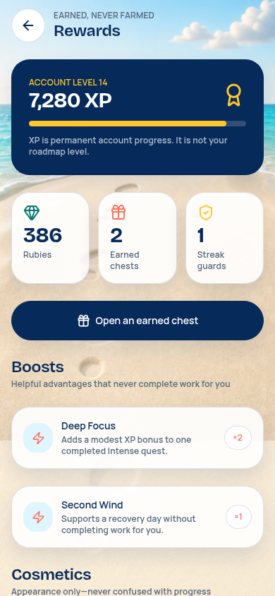

### 14. Analytics — useful shell, static period data

The hierarchy is strong, but Week and Month share the same values and series.

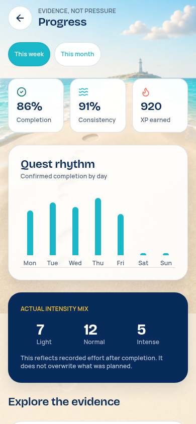

### 15. Reminders — healthy base

Permission, event types, and lead time are clear; notification-to-action navigation is still missing.

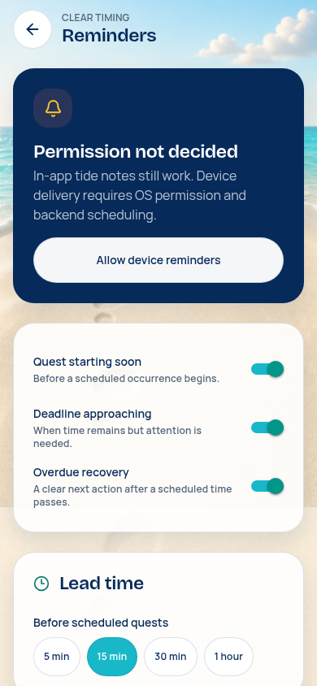

## Recommended frontend implementation sequence

This order closes the largest product-trust gaps without waiting for the backend:

1. **Calendar and scheduling foundation:** real date model, month/week ranges, pickers, structured recurrence, occurrence projection.
2. **Quest lifecycle:** complete edit/reschedule flow, per-occurrence vs series decisions, missed/overdue recovery.
3. **Roadmap authority:** full proposal editor and safe accepted-roadmap adjustment flow.
4. **Priority engine:** deterministic Today ordering with visible rationale and tests.
5. **Reward loop:** ruby ledger/spend, boosts, streak guards, final victory, completed-Odyssey history.
6. **Evidence and analytics:** distinct periods, habit/goal-specific reads, occurrence and proof histories.
7. **Accessibility cleanup:** decorative-image semantics, accessible-name matching, then native VoiceOver/TalkBack and dynamic-type checks.
8. **Backend connection:** session bootstrap, protected navigation, read-model loading, proof upload, server-owned reward/progress calculations, and live endpoint error handling.

## Definition of UI-complete for the next audit

The frontend will match `docs/PRODUCT.md` when:

- every row marked Partial or Missing above has a real user action or is explicitly removed from the product contract;
- no segmented control changes only its selected appearance;
- no reward inventory item is shown as usable without a use/unlock path;
- roadmap suggestions remain editable until acceptance and accepted-plan changes are explicit;
- every date, recurrence, deadline, and reminder flow is usable without typing machine-formatted timestamps;
- analytics periods and detail screens use feature-specific data;
- final victory and completed-journey evidence exist;
- accessibility failures found in the current-run report are fixed and native assistive-technology checks are completed.
