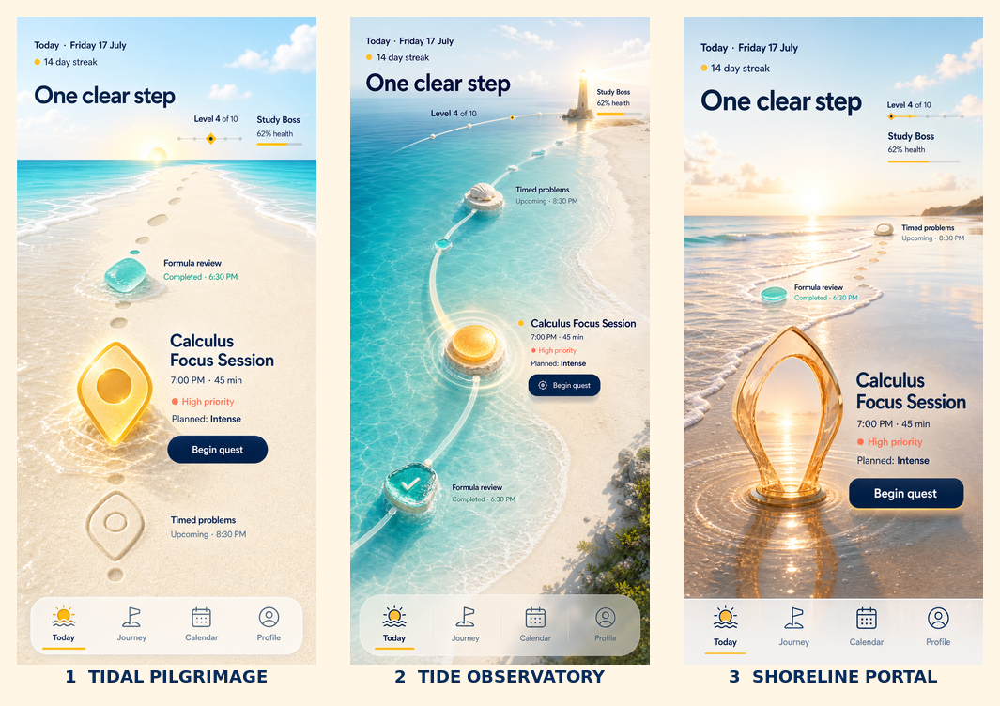

# Odyssey Today — approval concepts

These are static design concepts for the proposed Awwwards-level Today-screen redesign. They are isolated from the production frontend and exist only for visual approval.

## Quick comparison

| Option | File | Direction | Signature interaction |
| --- | --- | --- | --- |
| 1 | [`01-tidal-pilgrimage.png`](./01-tidal-pilgrimage.png) | A cinematic sandbar journey closest to the original Living Shore reference. | Footprints advance, foam moves, and the active marker refracts sunlight. |
| 2 | [`02-tide-observatory.png`](./02-tide-observatory.png) | A curved coastal map with quest islands and a lighthouse destination. | The glass route and water caustics orbit gently around the selected quest. |
| 3 | [`03-shoreline-portal.png`](./03-shoreline-portal.png) | A low-angle wet-sand scene built around one dramatic amber quest portal. | Beginning a quest lights the portal and sends a wave ring through the sand. |

## Status

- Approval only; none of these concepts has been integrated into the app.
- Each full-size concept is 853 × 1844 pixels.
- The production frontend remains unchanged.
- Choose `1`, `2`, or `3` before implementation begins.

